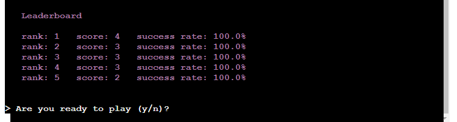

# WordPuzzles
WordPuzzles is a Python terminal game, which runs in the Code Institute mock terminal on Heroku.

This is simple game based on classic Word Search Puzzles, more information about the game can be found on [wikipedia](https://en.wikipedia.org/wiki/Word_search). In this game, each puzzle only have one hidden word and clues related to the word will be given to the player.

Click [here](https://kk-wordpuzzle.herokuapp.com) to access live site.

*Screenshot - Mockup on WordPuzzles, generated from [Multi Device Website Mockup Generator](https://techsini.com/multi-mockup/index.php)*

___

## Objectives

In this version of game, player is ask to solve puzzles by finding the hidden word in a 6x6 two dimensional grid. The hidden word is placed randomly in the grid and the other cells are filled with random alphabet.

The target audients will be players that wish to test their skills to find the hidden word.

### Application Goals
* Develop a game to test player puzzle solving skills
* To be used to develop and improve user problem solving skills 
* Introduce new words to user's vocabulary

### User Goals
* Use to develop problem solving skills
* Learning new words
___
## How to Play
* Instruction will be given to the player at the begining of the game.
* For each puzzle, a clue about the hidden word is display on the screen.
* Base on the clue, player need to find the word in the puzzle grid.
* Solve the puzzle by entering the answer.
* If the answer is correct then option is given to solve another puzzle.
* If answer incorrect then player can try again with another answer.
* Only 3 attempts allow for each puzzle. Extra clue will be given to each attempt.
* The answer always show at the end of each puzzle and display where the hidden word is on the grid.
Also, at the end of each puzzle, score will be displayed with option to play another puzzle.
___
## Game Design

### Initial Design
Based on the objectives, a game is to be developed to test the player's problem solving skills by searching a word hidden in a grid among with random alphabets.

A process flow chart was created to show the basic processes and logics of the game.

*Process Flow Chart - Initial Design*

### *Main Processes*
The following are the main processes to run the game.
* Display description and game instruction
* Display leader board for top 5 ranking
* Ask player to play game
* Select a random word for each puzzle
* Create puzzle grid and answer grid with random base values
* The selected word need to be inserted randomly for each puzzle
* Display puzzle grid with clues about the word
* Ask player to enter answer
* Validation on each answer and return result to player
* Allow 3 attempts to solve each puzzle
* Give further clue for each attempt
* Option to play another puzzle at the end of cureent puzzle
* Display final score
* Display and update leader board if score is within top 5
___

## Program Requirements

This project will be developed from a template created by Code Institute which allows python programs to run in a mock terminal.

From the design, this project is going to use a google drive and google sheet name “words” to store data for the game.
* A worksheet name “words” is used to store a list of words with its attributes. The process to populate this sheet is done by either manually type it in or copy and paste from external sources. This program only requires read access to this worksheet.
* A worksheet name “leaderboard” is used to store the top 5 ranking scores. Initially, all scores are set to zero and it will be updated by the game. So the program requires both read and write access to this wordsheet.

In order to use google drive and google sheets, authentication and credentials set up are needed before it can be accessed by the program. The following is a brief summary to activate the APIs:
* Go to the Google Cloud Platform webpage and login to an account
* Create a new project
* Select library under APIs and services
* Select and enable Google Drive API
* Create credentials and download credential json file to be used in the project
* Go back to the library, select and enable Google Sheet API
* Upload the credential jason file into the project repository and ensure the file is not share publicly
* Use the client email from the credential jason file to share the google sheet

To use Google Sheet API, 2 dependencies are needed to install into the project.
* Authentication to access the Google Cloud Project
* gspread library to access the spreadsheet
The command to install these packages is "pip3 install gspread google-auth"

After the packages have been installed then it need to be imported into the python program file with an IAM configuration. The following is the section of the code required to access the spreadsheet.

>import gspread
>
>from google.oauth2.service_account import Credentials
>
>SCOPE = [
>    "https://www.googleapis.com/auth/spreadsheets",
>    "https://www.googleapis.com/auth/drive.file",
>    "https://www.googleapis.com/auth/drive"
>   ]
>
>CREDS = Credentials.from_service_account_file('creds.json')
>
>SCOPED_CREDS = CREDS.with_scopes(SCOPE)
>
>GSPREAD_CLIENT = gspread.authorize(SCOPED_CREDS)

The following libraries or modules are also needed to run the program.
* random (number generator module)
* sys (module for System-specific parameters and function)
* numpy (library for scientific computing with Python)
* colorama (for producing colored terminal text)
___

## Features
At the beginning of the game, a validation process will be carried out to check the existence of the import spreadsheet. The game will terminate and exit the program with an error message if it can't find the file. When access to the spreadsheet is available then the player will be greeted with a short description and instruction about the game.

Then follow by displaying the leader board with the top 5 ranking.

The information on the leader board is also held in an external worksheet called "leaderboard". This information is imported and load it into a list of dictionaries.
* Validation will be check against worksheet
* Exit program with error message when worksheetdoes not exist

The game will pause at this point and wait for the player’s input response to continue or exit the game.

The player's response will be validated and only accept "Y" or "N". Case is not senstive as the letter will be converted to uppercase. For invalid entry, a messagi with "Invalid Entry" will display and ask to enter "y/n".

If the response is "N" then the game will be terminated with a message saying "You have exit the game".

A puzzle grid with the hidden word will be presented when the player decided to continue to play the game.

The following processes will be carried out to create each puzzle:

* Load the words from an external spreadsheet into a list of dictionaries. This action only perform once at the beginning of the game
    * Validation will be check against worksheet
    * Exit program with error message when worksheetdoes not exist
* Create 2 puzzle grids with base values
    * A 6x6 puzzle grid populated with random alphabet
    * A 6x6 answer grid populated with “-“
* Select a word randomly from the list of dictionaries 
    * There is a validation on the length of the word before it can be inserted into the grid. This to ensure the word is not longer than the grid size. If validation failed then it will try another word from the list. It will attempt for 100 times before exit the game with an error message.
* Perform below criteria to insert the word identically into both the puzzle and answer grid
    * Randomly select the direction to place the word horizontally or vertically
    * Randomly spell the word normally or backward
    * Randomly find a starting position to place the word in the grid
* For the first puzzle, display a messages about the hidden word in the puzzle grid and allow 3 attempts to solve the puzzle
* For all puzzles, display a clue about the word (type and length of word)
    * Currently, the list contains words with 4 or 5 letters and it could be a name of an Animal, a Bird or a Fruit

At this point, the game will pause and ask player to enter an answer

Player can enter anything at this point but a basic validation on length will be carried out before comparing the answer. Also all answers will be converted to upper case.

The validation and checking the answer are as follows:
* A message will display to indicate the answer word is too short when the length is shorter than the puzzle word.

    *Example - First answer was too short*

    
* A message will display to indicate the answer word is too long when the length is longer than the puzzle word.

    *Example - Second answer was too long*

    
* When the length is matched then the answer word will compare with the puzzle word. The result either correct or incorrect.

    *Example - Final answer was incorrect*

    
* When the answer is matched to the puzzle word then a congratulation message will display. Follow by displaying the answer grid to confirm where the hidden word was.

    *Example - A correct answer*

    
* When the answer is incorrect then it will display an incorrect message and perform the following processes *(see previous screenshots)*:
    * Display original clue
    * Display an additional clue with the first letter of the word
    * Display the puzzle grid again
    * Display a message with 2 attempts left to solve the puzzle
    * Ask the player to enter another answer
    * The validation and checking will repeat against the new answer
    * If the answer still incorrect then the process repeats with second letter of the word as an additional clue and indicate there is 1 more attempt left. Player ask to enter another answer.
    * The validation and checking will repeat against the final answer
    * If the answer still incorrect then it will show the answer is wrong and display the puzzle word with the answer grid showing where the word was hidden.
* A score tally will display at the end of each puzzle
* Also, an option is available to play another puzzle
* The processes will repeat and create a new puzzle grid if the player choose to play again. Otherwise the game will end with a message.

When the player wishes to end the game, the score in this session will compare the scores in the leader board before displaying a message to thank the player for playing the game.

*Example - Exit Game*

If the score is within top 5 then a congratulation message will be displayed with the leader board and indicate the position you have achieved. This mean the leader board will be adjusted to cater the new entry and remove the lowerest score on the table.

The ranking calculation is based on the following:
* Total number of solved puzzles and the success rate of the game
* Success rate is a percentage which calculated by (number of solved puzzle / Total number of puzzles played) * 100

The external worksheet will be updated with the new leader board scores.

*Example - Rank Top 5*

___
## Future Features
The following features can be developed in the future to add values to the game and user experiences.
* Add player login details.
* Modify leader board to include player’s name
* Increase grid size and ability to change size based on the word length
* Build an extensive list of words with length beyond 5 letters
* Add extra hidden words in puzzle
___
## Data Model

___
## Validator Testing

___
## Testing

___
## Unfix Bugs
There are no known bugs to be fixed.
___
## Deployment
This project will be deployed in Heroku and use a mock terminal to run the program.

In order to run this program, the dependencies on this project also need to be deployed. This is done by submitting the following command to create the requirement.txt file.
* pip3 freeze > requirements.txt

The requirements.txt will includes dependencies for Google authentication, gspread, numpy, sys, PyPi modules and colorama.

It was noticed that this command did not include the colorama and the following was manually added to the list in the file.
* colorama==0.4.4

This file needs to be pushed to github before Heroku can use this file to include the dependencies for the program.

The following are the steps to deploy the project to Heroku.
1. Go to Heroku account and click "Create a new app".
2. After choosing the app name and setting the region, press "Create app".
3. Go to "Settings" and navigate to Config Vars.
4. Add a Config Var with a key word of called CREDS and use the contents from credential json file as the value.
5. Add another Config Var with a key word of called PORT and a value of 8000.
6. Navigate to Buildpacks in the Settings and add buildpacks for Python and NodeJS. Must add these buildpacks in this order.
7. Go to "Deploy" tab section. Scroll down and set Deployment Method to GitHub.
8. Select the repository to be deployed and connect it to Heroku.
9. Check "main" is selected for the branch in the deploy section and select "Enable Automatic Deploys".
10. Click "Open App" at the top when its finished deploy the app. A new tab page will open with your application.

The deployed app can be found [here](https://kk-wordpuzzle.herokuapp.com).
___
## Tools
The tools used to carry out the development and deployment on this project are:
* Gitpod and Github
* Google Drive and Google Spreadsheet
* Python modules and external libraries such as Numpy
* Chrome Dev Tools
* PEP8 online checker
* Webpage Screenshots - Chrome app extension (FireShot)
* Heroku
___
## Credits