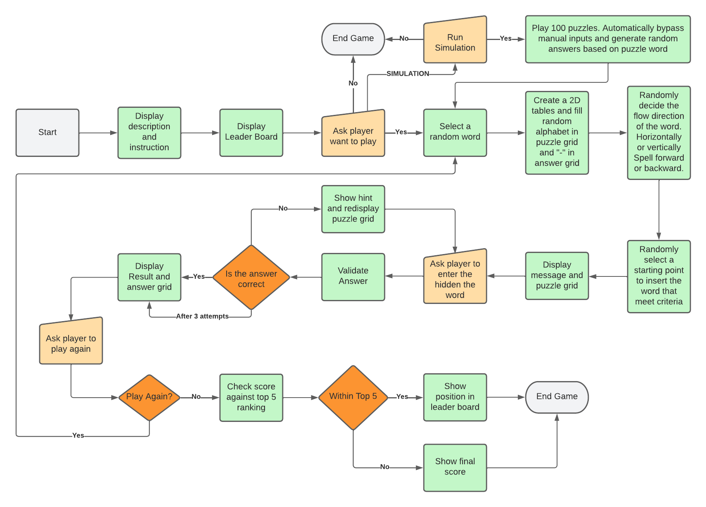

# WordPuzzles
WordPuzzles is a Python terminal game, which runs in the Code Institute mock terminal on Heroku.

This is simple game based on classic Word Search Puzzles, more information about the game can be found on [wikipedia](https://en.wikipedia.org/wiki/Word_search). In this game, each puzzle only have one hidden word and clues related to the word will be given to the player.

Click [here](https://kk-wordpuzzle.herokuapp.com) to access live site.

*Screenshot - Mockup on WordPuzzles, generated from [Multi Device Website Mockup Generator](https://techsini.com/multi-mockup/index.php)*

___

## Objectives

In this version of game, player is ask to solve puzzles by finding the hidden word in a 6x6 two dimensional grid. The hidden word is placed randomly in the grid and the other cells are filled with random alphabet.

The target audients will be players that wish to test their skills to find the hidden word.

### Application Goals
* Develop a game to test player puzzle solving skills
* To be used to develop and improve user problem solving skills 
* Introduce new words to user's vocabulary

### User Goals
* Use to develop problem solving skills
* Learning new words
___
## Game Design

### Initial Design
Based on the objectives, a game is to be developed to test the player's problem solving skills by searching a word hidden in a grid among with random alphabets.

A process flow chart was created to show the basic processes and logics of the game.

*Process Flow Chart - Initial Design*

### *How to Play Processes*
The following are the main processes to run the game.
* Display description and game instruction
* Display leader board for top 5 ranking
* Ask player to play game
* Select a random word for each puzzle
* Create puzzle grid and answer grid with random base values
* The selected word need to be inserted randomly for each puzzle
* Display puzzle grid with clues about the word
* Ask player to enter answer
* Validation on each answer and return result to player
* Allow 3 attempts to solve each puzzle
* Give further clue for each attempt
* Option to play another puzzle at the end of cureent puzzle
* Display final score
* Display and update leader board if score is within top 5
___
## How to Play
* Instruction is given to the player at the begining of the game.
* For each puzzle, a clue about the hidden word is display on the screen.
* Base on the clue, player need to find the word in the puzzle grid.
* Solve the puzzle and enter the answer.
* If the answer is correct then option is given to solve another puzzle.
* If answer incorrect then player can try again with another answer.
* Only 3 attempts allow for each puzzle. Extra clue will be given to each attempt..
* The answer always show at the end of the puzzle where the hidden word is on the grid.
* At the end of each puzzle, score will be displayed with option to play another puzzle 

___
## Features